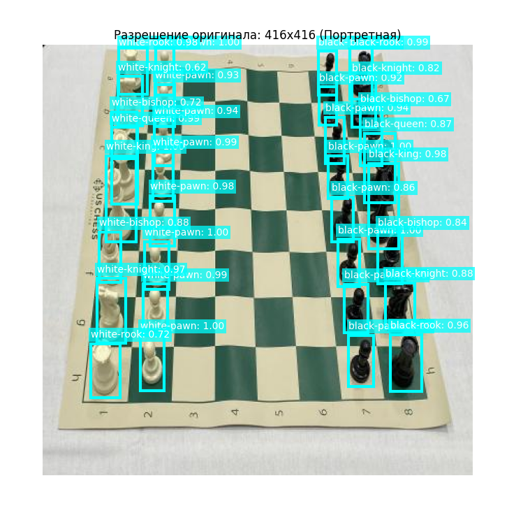
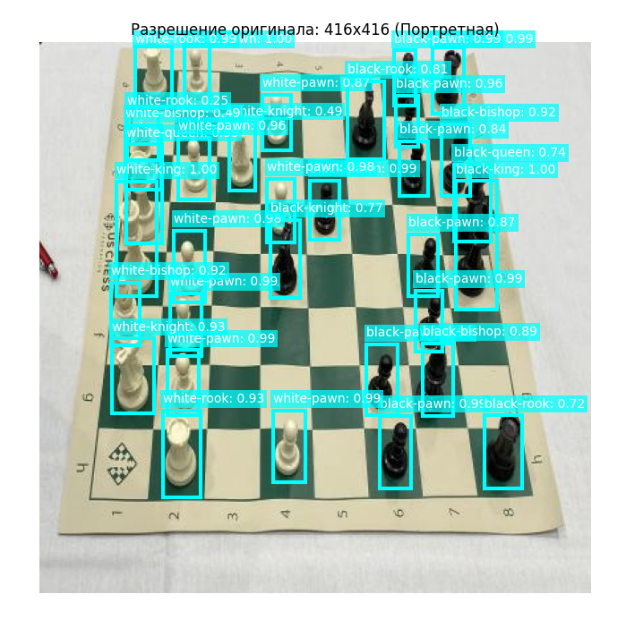
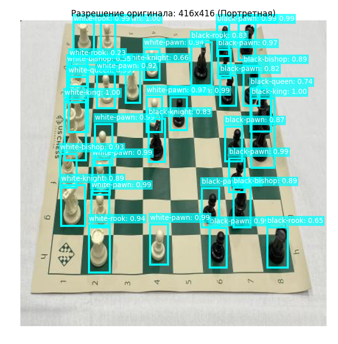

# Chess Piece Detection with YOLOv3

[English](#english) | [Русский](#русский)

---

## English

### Overview

This project is a custom implementation of a YOLOv3-style object detector for chess piece recognition.  
The model is trained from scratch in PyTorch and predicts 12 chess piece classes:

- black-bishop
- black-king
- black-knight
- black-pawn
- black-queen
- black-rook
- white-bishop
- white-king
- white-knight
- white-pawn
- white-queen
- white-rook

The repository includes the full training pipeline: dataset loading, target generation, model architecture, loss function, checkpointing, and inference.

### Features

- Custom YOLOv3-style detector implemented in PyTorch
- Training and validation loops with checkpoint saving
- Best-checkpoint inference workflow
- Bounding box decoding and non-maximum suppression
- Support for Roboflow-oriented labels converted to axis-aligned boxes

### Project Structure

```text
.
├── assets/                  # README screenshots
├── notebooks/               # notebook experiments, dataset, checkpoints
├── src/
│   ├── config.py
│   ├── dataset.py
│   ├── download_dataset.py
│   ├── loss.py
│   ├── model.py
│   ├── predict.py
│   └── train.py
├── main.py                  # CLI entry point
└── requirements.txt
```

### Dataset

The project uses the Roboflow chess dataset stored under `notebooks/chess_yolo/chess_yolo/`.

- Train images: `606`
- Validation images: `58`
- Test images: `29`
- Input size: `320 x 320`

### Training

Install dependencies:

```bash
pip install -r requirements.txt
```

Run training:

```bash
python3 -m main train
```

The training script saves:

- latest checkpoint: `notebooks/yolov3_checkpoint.pth`
- best checkpoint: `notebooks/yolov3_best.pth`

### Inference

Run prediction on an image:

```bash
python3 -m main predict --image assets/example_1.png
```

Inference uses the best saved checkpoint by default.

### Results

Examples below show predictions produced by the trained model on dataset-style images.







### Notes and Limitations

- The detector performs best on images that are visually close to the training dataset distribution.
- Generalization to external images with different boards, lighting, camera angles, or piece styles is more limited.
- This repository is focused on a from-scratch educational implementation of YOLOv3-style detection rather than a production-optimized detector.

---

## Русский

### Описание

Этот проект представляет собой собственную реализацию детектора объектов в стиле YOLOv3 для распознавания шахматных фигур.  
Модель обучается с нуля на PyTorch и предсказывает 12 классов фигур:

- black-bishop
- black-king
- black-knight
- black-pawn
- black-queen
- black-rook
- white-bishop
- white-king
- white-knight
- white-pawn
- white-queen
- white-rook

В репозитории есть полный пайплайн: загрузка датасета, генерация target-ов, архитектура модели, функция потерь, сохранение чекпоинтов и инференс.

### Возможности

- Собственная YOLOv3-style модель на PyTorch
- Циклы обучения и валидации с сохранением чекпоинтов
- Инференс через лучший сохраненный чекпоинт
- Декодирование bounding boxes и non-maximum suppression
- Поддержка ориентированной разметки Roboflow с переводом в обычные прямоугольные боксы

### Структура проекта

```text
.
├── assets/                  # скриншоты для README
├── notebooks/               # эксперименты в ноутбуке, датасет, чекпоинты
├── src/
│   ├── config.py
│   ├── dataset.py
│   ├── download_dataset.py
│   ├── loss.py
│   ├── model.py
│   ├── predict.py
│   └── train.py
├── main.py                  # CLI entry point
└── requirements.txt
```

### Датасет

Проект использует шахматный датасет Roboflow, который хранится в `notebooks/chess_yolo/chess_yolo/`.

- Train images: `606`
- Validation images: `58`
- Test images: `29`
- Размер входа: `320 x 320`

### Обучение

Установка зависимостей:

```bash
pip install -r requirements.txt
```

Запуск обучения:

```bash
python3 -m main train
```

Скрипт обучения сохраняет:

- последний чекпоинт: `notebooks/yolov3_checkpoint.pth`
- лучший чекпоинт: `notebooks/yolov3_best.pth`

### Инференс

Запуск предсказания на изображении:

```bash
python3 -m main predict --image assets/example_1.png
```

По умолчанию для инференса используется лучший сохраненный чекпоинт.

### Результаты

Ниже показаны примеры предсказаний модели на изображениях, близких к обучающему датасету.


### Ограничения

- Детектор лучше всего работает на изображениях, визуально похожих на обучающий датасет.
- Обобщение на внешние изображения с другой доской, освещением, ракурсом камеры или стилем фигур заметно слабее.
- Репозиторий в первую очередь показывает учебную реализацию YOLOv3-style детектора с нуля, а не production-оптимизированную систему.
